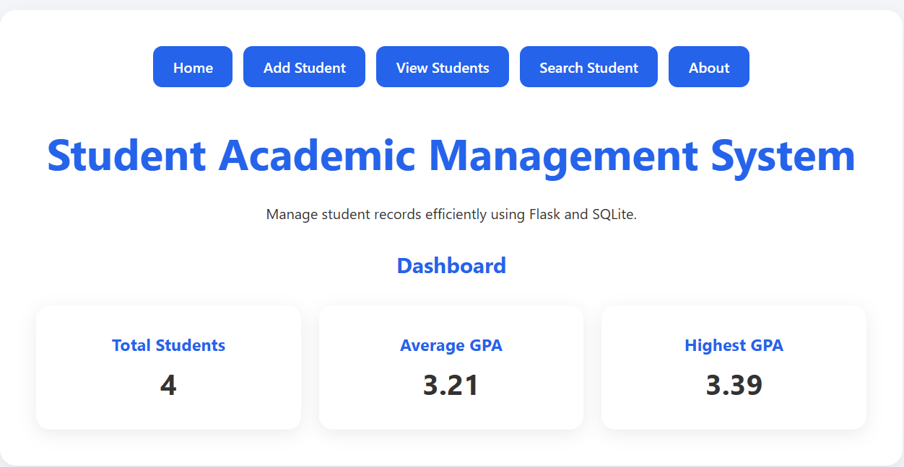
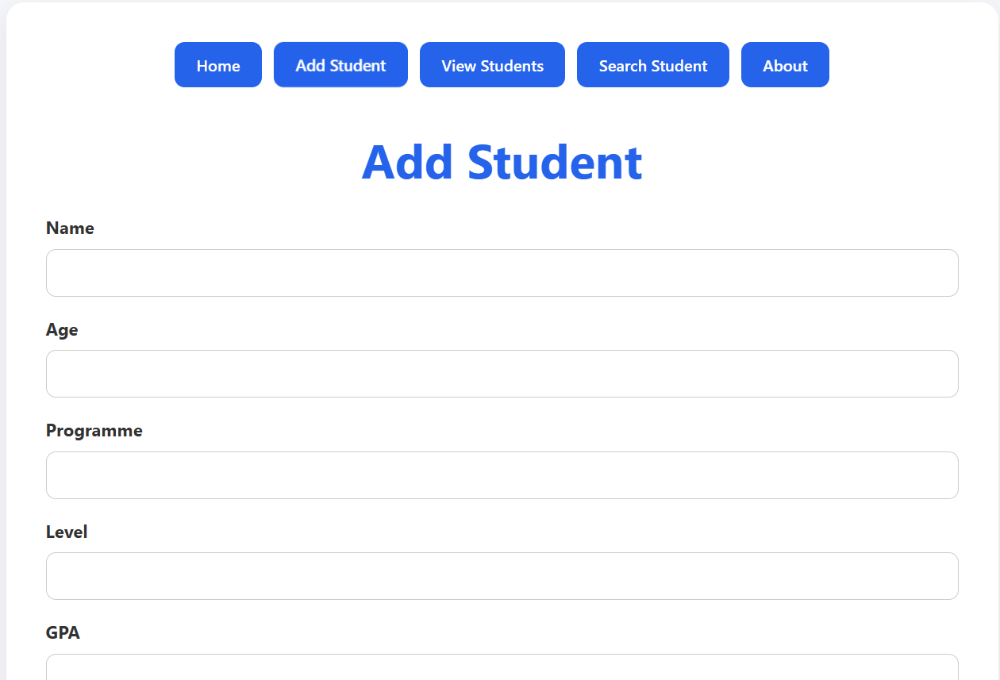
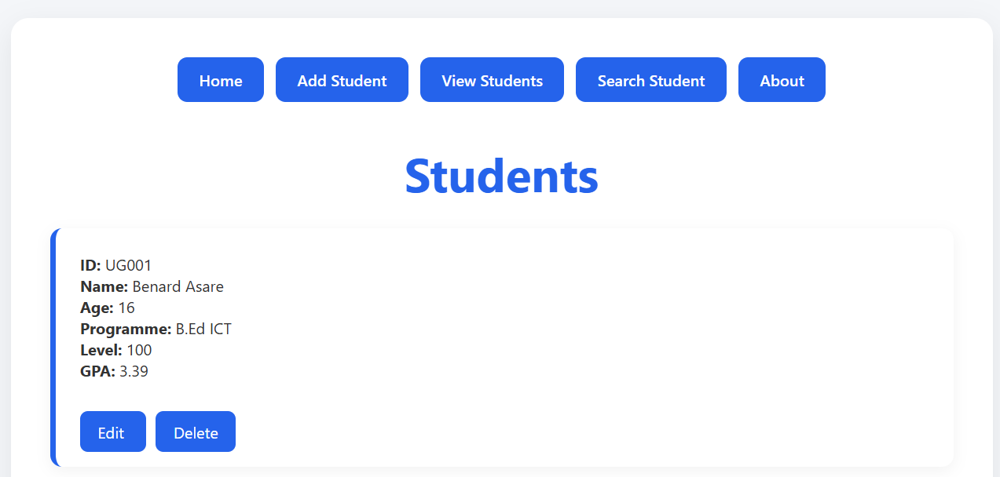
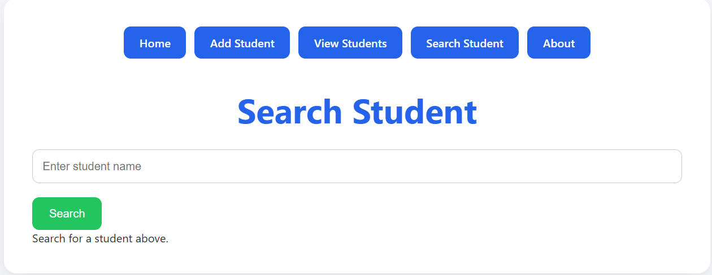
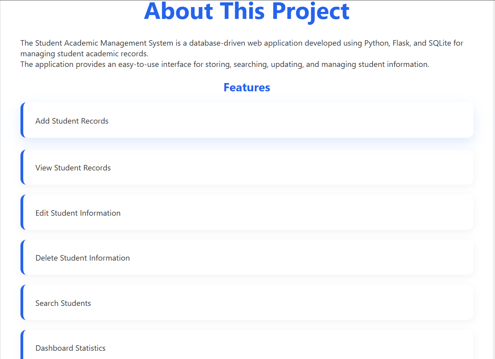

# Student Academic Management System

A full-stack web application developed using Python, Flask, SQLite, HTML, CSS, and JavaScript for managing student academic records.

The system provides an intuitive interface for adding, viewing, editing, deleting, and searching student information while displaying useful academic statistics through a dashboard.

## Features

- Add Student Records
- View Student Records
- Edit Student Information
- Delete Student Information
- Search Students by Name
- Dashboard Statistics
  - Total Students
  - Average GPA
  - Highest GPA
- Responsive User Interface
- Modern CSS Styling and Animations
- SQLite Database Integration

## Technologies Used

- Python
- Flask
- SQLite
- HTML5
- CSS3
- JavaScript

## Project Structure

``` text
student-academic-management-system/
│
├── app.py
├── db.py
├── database.py
├── reset_database.py
├── view_database.py
│
├── templates/
│   ├── index.html
│   ├── add_student.html
│   ├── edit_student.html
│   ├── view_students.html
│   ├── search_student.html
│   └── about.html
│
├── static/
│   └── style.css
│
├── screenshots/
│   ├── home-dashboard.png
│   ├── add-student.png
│   ├── view-students.png
│   ├── search-student.png
│   └── about-page.png
│
├── README.md
└── requirements.txt
```

## Database Fields

Each student record contains:

- Student ID
- Name
- Age
- Programme
- Level
- GPA

## Installation

### Clone the Repository

```bash
git clone https://github.com/BenjaminAyivoh1/student-academic-management-system.git
```

### Move into the Project Folder

```bash
cd student-academic-management-system
```

### Install Dependencies

```bash
pip install -r requirements.txt
```

### Create the Database

```bash
python database.py
```

### Run the Application

```bash
python app.py
```

Open:

```text
http://127.0.0.1:5000
```

### Home Dashboard 

Displays:

- Total Students
- Average GPA
- Highest GPA

### Add Student

Allows users to add student academic information into the database

### View Students

Displays all student records with edit and delete functionality

### Search Student

Allows users to search student records by name

### About Page

Provides information about the application and technologies used

## Screenshots










## Skills Demonstrated

This project demonstrates:

- Flask Routing
- CRUD Operations
- SQLite Database Integration
- HTML Templates (Jinja2)
- CSS Styling
- Database Queries
- Form Handling
- JavaScript DOM Manipulation
- JavaScript Counter Animations
- Full-Stack Web Development Fundamentals

## Future Improvements
- User Authentication and Login System
- Role-Based Access Control 
- Student Photo Uploads
- Export Records to PDF 
- Advanced GPA Analytics
- Cloud Databse Integration
- Application Deployment

## Developer

**Benjamin Ayivoh**

University of Ghana

## License

This project was developed for educational purposes and learning purposes